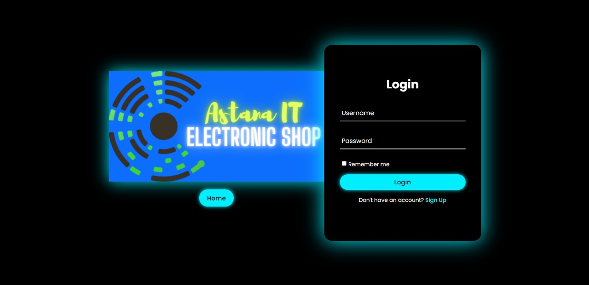
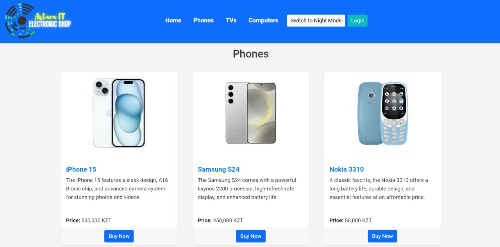
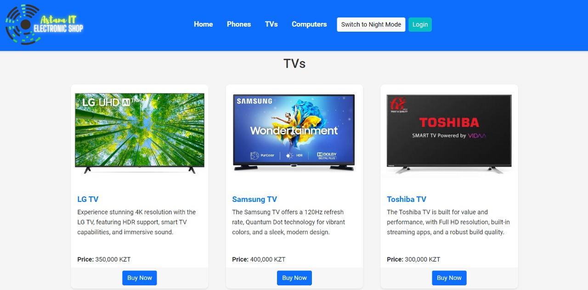
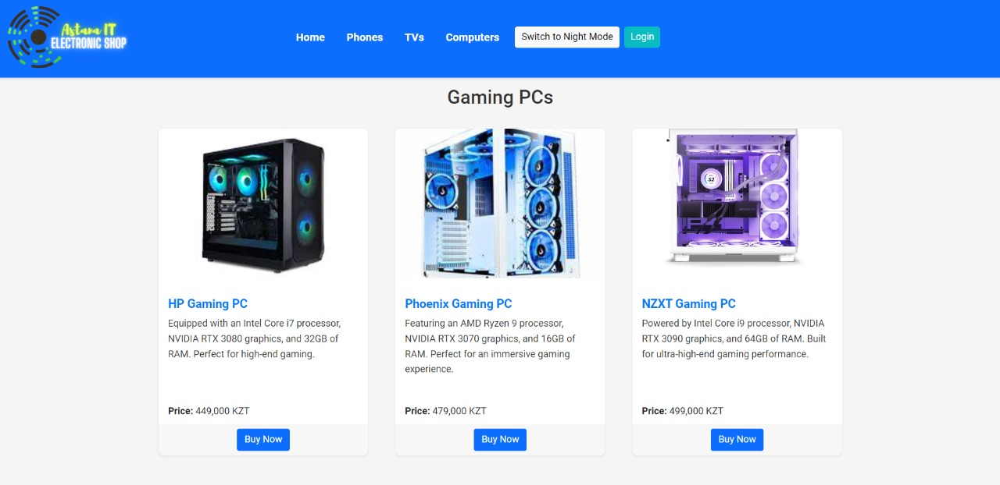
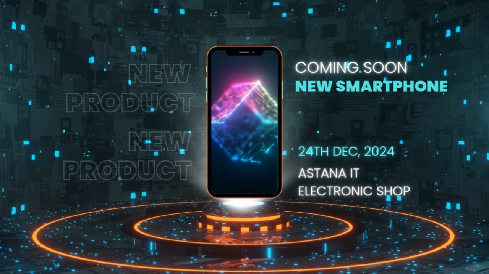

# 🌐 AITES - Astana IT Electronic Shop 🌐


---

## 📖 Project Overview

Welcome to **AITES**, your one-stop shop for all things tech! 🚀 We bring the latest gadgets and electronics right to your screen, featuring everything from powerful gaming laptops to cutting-edge smartphones. Whether you're upgrading or exploring, AITES is here to make your shopping experience intuitive, informative, and fun! 🎉

## 🎯 Key Features

✨ **Wide Product Range:** From iPhones 📱 to Gaming PCs 🎮, we've got options for every tech enthusiast and casual user alike.

🎨 **Customizable Experience:** Toggle between Day 🌞 and Night 🌙 modes for comfortable browsing any time of day. Your theme and rating preferences are saved, so your personalized experience is ready for you on every visit!

⭐ **Product Ratings:** Rate your favorite products on a 5-star scale to get personalized recommendations. Your ratings also help fellow tech enthusiasts make informed choices!

🎥 **New Product Previews:** Check out our featured product videos, like the latest iPhone 16 📱 ([i16.mp4](images/i16.mp4)), for an immersive sneak peek.

🛠️ **Detailed Product Insights:** Each product page is packed with FAQs, specifications, and high-quality images to guide you in making the best choices.

📅 **Dynamic Content:** Real-time greetings based on the time of day, a 'Random Fact' button with fun electronics trivia, and an interactive 'Read More' toggle create an engaging experience!

🔒 **Secure Login/Signup:** Your data is safe with us! Log in to access personalized features, or sign up to start shopping with confidence.

## 🚀 Quick Start

1. **Clone the repo:**

   ```bash
   git clone https://github.com/nur1kesh/AITES.git
   cd AITES
   ```

2. **Install dependencies** (if needed):

   ```bash
   npm install
   ```

3. **Launch the Project:**

   Simply open `index.html` in your browser:

   ```bash
   open index.html
   ```

## 🛍️ How to Shop

- **Navigate** through categories (Phones, TVs, and Computers) from the top bar.
- **Switch Modes** to browse comfortably in either Day or Night theme.
- **Rate Products** by clicking the stars 🌟. Your ratings will help personalize your shopping experience!
- **Log In/Sign Up** for a seamless experience that saves your preferences.
- **Explore FAQ & Support** sections for any product-related questions, or contact us directly if you need help!

## 🖼️ Media and Demo

### 📸 Screenshots

**  
**  
**  
**  

### 📹 Demo Video

Check out our [AITES product demo](images/i16.mp4) to see what’s new and exciting in our lineup!
** 

## 🌟 Special Features

- **💻 Responsive Design:** Shop on any device with our mobile-friendly layout.
- **📞 24/7 Customer Support:** Chat, email, or call us anytime for help or product advice.
- **🔥 Hot Deals:** Discover discounts and promotions, so you never miss a great deal.
- **💳 Flexible Payment Options:** Multiple payment methods are available, making checkout easy and secure.

## 🔮 Coming Soon!

- 📝 **Wishlist & Save for Later**: Save your favorite items for future purchases.
- 🕵️‍♂️ **Advanced Filters and Search**: Find exactly what you're looking for with specialized filters.
- 🌟 **Customer Reviews**: Soon, you’ll be able to see what others are saying about each product.

---

### 🧑‍💻 Contributing

Want to help improve AITES? Feel free to fork, make a pull request, or simply share your ideas!

---

### 🎉 Why Choose AITES?

With AITES, you're not just shopping—you're joining a community of tech lovers who want quality, convenience, and exceptional customer service. Ready to make your next tech purchase? Start exploring our store today! 💼
